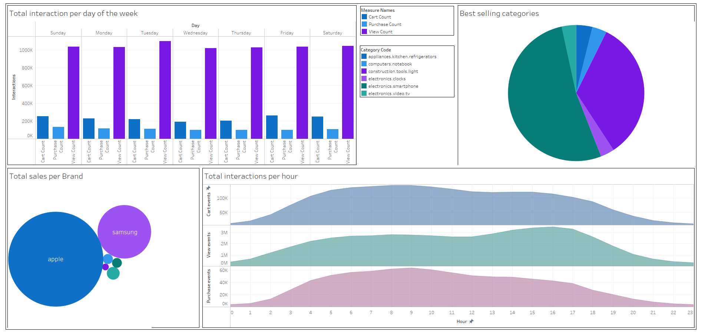

# Batch Processing Pipeline with Dataflow
A pipeline to read text files from Cloud Storage and load them into a BigQuery dataset with Dataflow. The objective is to consume the BigQuery Dataset in Tableau to present a dashboard of the reports obtained from the [analysis of an eCommerce behavior dataset](https://github.com/hijpax/SparkPractice).

To do this, the structure presented in [the GCP examples](https://github.com/GoogleCloudPlatform/professional-services/tree/main/examples/dataflow-python-examples/batch-examples/cookbook-examples) was followed.


## Project Structure
|      FOLDER/FILE      | PURPOSE                                                                                                                                                                                                                                                            |
|:---------------------:|--------------------------------------------------------------------------------------------------------------------------------------------------------------------------------------------------------------------------------------------------------------------|
|         data/         | It includes all the sub-folders corresponding to the reports that will be loaded into BigQuery. Each folder contains a ``data.csv`` file with the data and its ``schema.json`` with the schema structure.                                                          |
| data/report_names.txt | This text file lists the names of the subfolders that will be read by the script to generate an extract-transform-load job for each one, from the files ``data.csv`` and ``schema.json `` corresponding.                                                           |
|       pipeline/       | Contains the python script [generate_jobs.py](./pipeline/generate_jobs.py) that will generate the jobs in Dataflow to read the data from Cloud Storage and load it into BigQuery. It also contains the ``requirements.txt`` file with the python libraries to use. |
|      Dockerfile       | From this file, the docker image is generated with the necessary environment to execute the script. It builds from an image with Python 3.7 and Beam 2.24.0 and installs ``requirements.txt`` from the ``pipeline`` folder.                                        |


The following sections cover setting up authentication and environment, and how to run the pipeline. Then the results in Tableau.

## Enabling APIs
1. Set the default project to the one in which you want to enable the API
```shell
gcloud config set project <PROJECT_ID>
```
2. Enabled CLoud Storage and Dataflow APIs.
```shell
gcloud services enable storage-component.googleapis.com dataflow.googleapis.com
```
## Setting up authentication
It's required get the permissions to use the Cloud Storage Client Library, Dataflow API, and perform actions on the BigQuery dataset. One way to do this is to create a service account with the correct roles and set an environment variable, as shown in the following steps.

1. Create the service account (in this case with the name "pipeline"):
```shell
gcloud iam service-accounts create pipeline
 ```
2. Grant roles to the service account. The role IDs:
  - roles/bigquery.dataEditor
  - roles/storage.admin
  - roles/dataflow.admin
  - roles/dataflow.worker
  - roles/iam.serviceAccountUser

  Run the following command one time for each role: 

```shell
gcloud projects add-iam-policy-binding <PROJECT_ID> --member="serviceAccount:pipeline@<project-id>.iam.gserviceaccount.com" --role=<ROLE_ID>
   ```
   
4. Generate the key file:

```shell
gcloud iam service-accounts keys create /<HOME_PATH>/keys.json --iam-account=pipeline@<PROJECT_ID>.iam.gserviceaccount.com
```
   
## Setting up environment
Now, it is time to get the pipeline file, add the data file to Cloud Storage, and set the environment variables.

1. Open the Cloud Shell and clone this repository
```shell
git clone https://github.com/hijpax/BatchProcessingPipeline.git
cd BatchProcessingPipeline/
```
3- Create a Cloud Storage Bucket
```shell
gsutil mb gs://<BUCKET_NAME>
```
4- Copy data folder to the bucket
```shell
gsutil cp -r data/ gs://<BUCKET_NAME>/
```
5- Create the BQ dataset
```shell
bq mk <DATASET_NAME>
```
4- Build the Docker image
```shell
docker build -t beam_python .
```

## Run the pipeline code
1. Run a docker container with the new image
```shell
docker run -it -e -v /<HOME_PATH>/keys.json:/keys.json -v $(pwd)/pipeline:/pipeline beam_python
```
2.  Set the environment variables, and replace with the Project's ID, Bucket name, and BigQuery Dataset name used in the previous steps.
```shell
export GOOGLE_APPLICATION_CREDENTIALS=/keys.json \
export PROJECT=<PROJECT_ID> \
export INPUT_BUCKET=<BUCKET_NAME> \
export INPUT_PATH=data \
export FILES_LIST=report_names.txt \
export BQ_DATASET=<BIGQUERY_DATASET>
```
3. Run the solution
```shell
python generate_jobs.py \
--project=$PROJECT --region= \
--runner=DataflowRunner \
--staging_location=gs://$INPUT_BUCKET/test \
--temp_location gs://$INPUT_BUCKET/test \
--input-bucket=$INPUT_BUCKET \
--input-path=$INPUT_PATH \
--input-files-list=$FILES_LIST \
--bq-dataset=$BQ_DATASET 
```

## Results in Tableau
To connect the BigQuery Dataset I followed the steps described in [Google BigQuery section](https://help.tableau.com/current/pro/desktop/en-us/examples_googlebigquery.htm) in Tablea documentation.
Its possible create worksheets, charts, or complete dashboard like this:



## Resources consulted
* [Override the organization policy for a project](https://cloud.google.com/resource-manager/docs/organization-policy/using-constraints#v2-api_6)
* [Google BigQuery - Tableau](https://help.tableau.com/current/pro/desktop/en-us/examples_googlebigquery.htm)
* [Requiring permission to attach service accounts to resources - Dataflow](https://cloud.google.com/iam/docs/service-accounts-actas#dataproc-dataflow-datafusion)
* [Bigquery - Data Types](https://cloud.google.com/bigquery/docs/reference/standard-sql/data-types#data_type_properties)
* [Cloud Storage client libraries setup](https://cloud.google.com/storage/docs/reference/libraries#client-libraries-install-python)
* [Read files in Google Cloud Storage Bucket Using Python](https://github.com/vigneshSs-07/Cloud-AI-Analytics/tree/main/Cloud%20Storage#hands-on-on-read-files-in-google-cloud-storage-bucket-using-python)
* [How to Read Different Types Of files from Google Cloud Storage Bucket Using Python](https://www.youtube.com/watch?v=bHudgNDyltI&t=117s)
* [Google APIs tips](https://stackoverflow.com/questions/56302658/anonymous-caller-does-not-have-storage-objects-get)
* [Writing an ETL pipeline using Apache Beam and Cloud Dataflow (Python) - Lab](https://www.cloudskillsboost.google/course_sessions/1524821/labs/103668)
* [Basic ETL pipeline](https://github.com/GoogleCloudPlatform/training-data-analyst/blob/master/quests/dataflow_python/1_Basic_ETL/solution/my_pipeline.py)
* [Dataflow python - batch examples](https://github.com/GoogleCloudPlatform/professional-services/tree/main/examples/dataflow-python-examples/batch-examples/cookbook-examples)
* [Cloud Storage to Big Query Batch Job - Tutorial](https://www.youtube.com/watch?v=km9ZR6gVYe0)
* [Enable the Required GCP APIs](https://docs.lacework.com/onboarding/gcp-enable-the-required-apis)